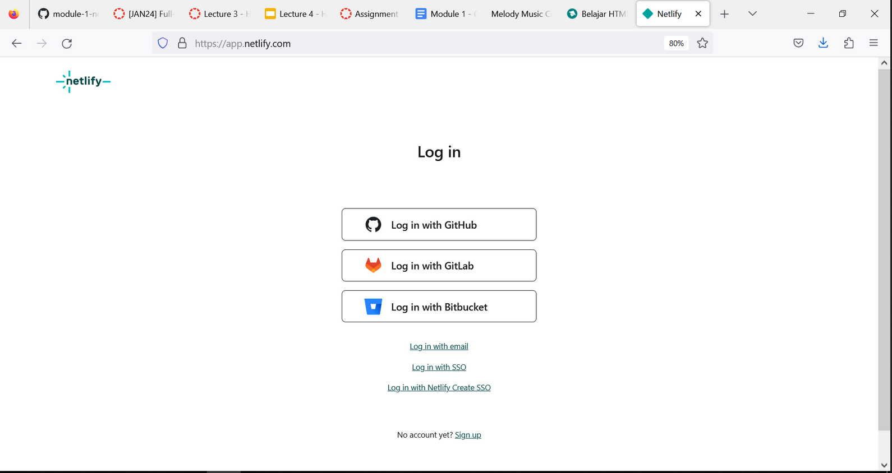
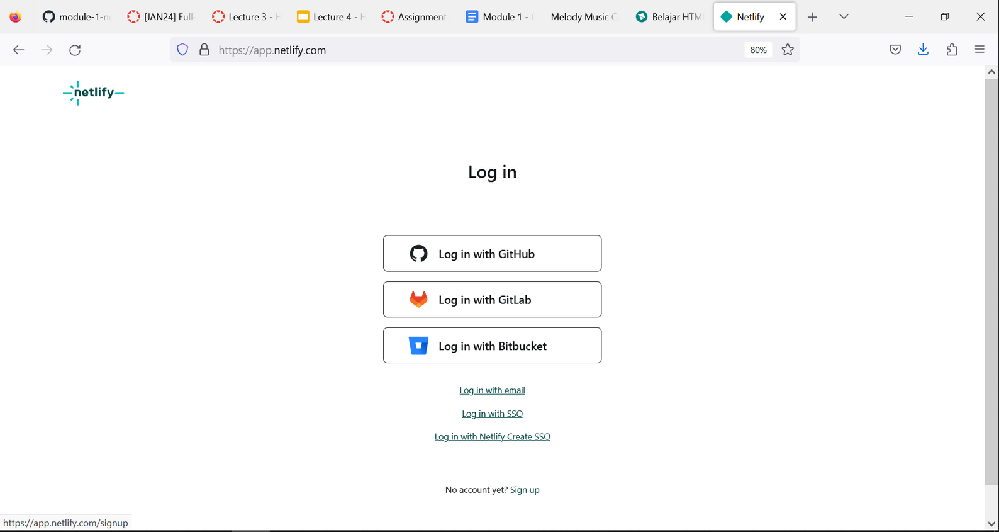
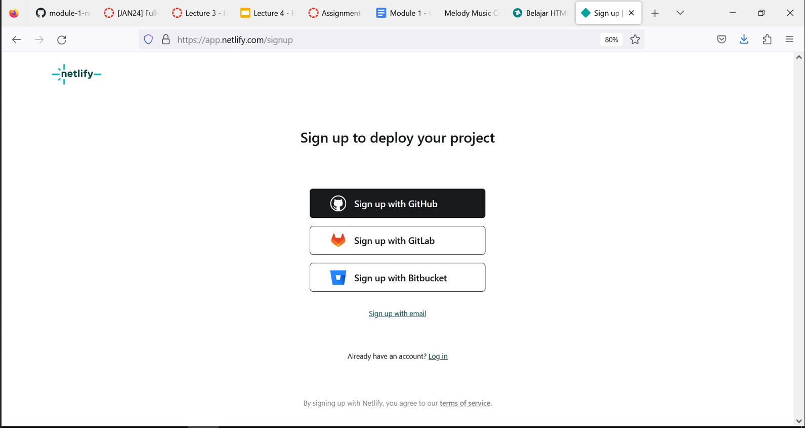
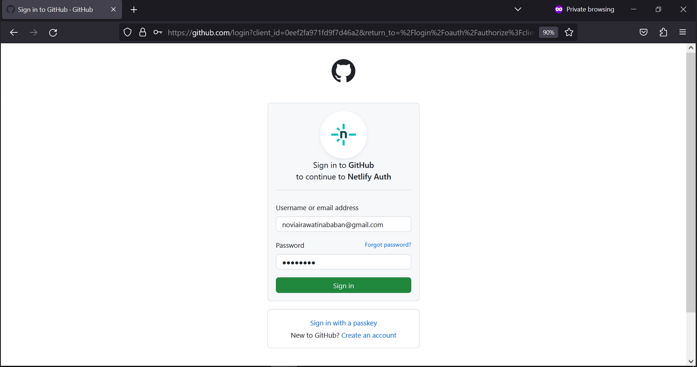
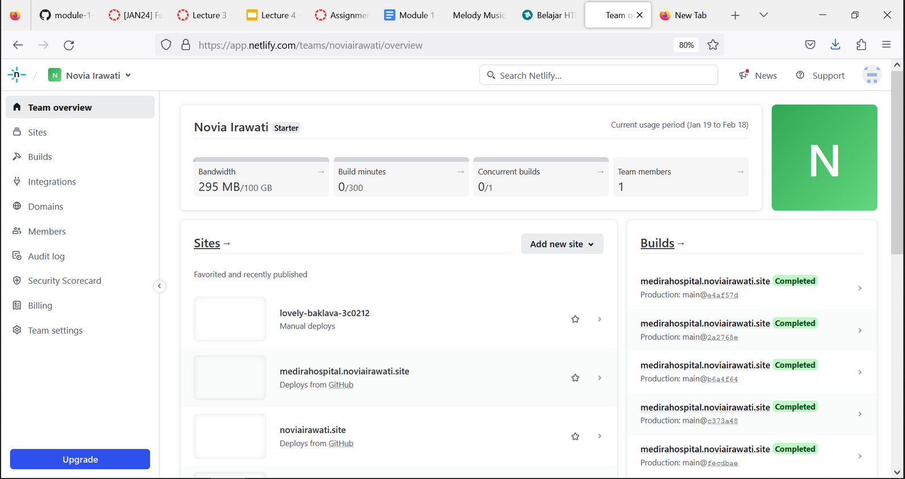
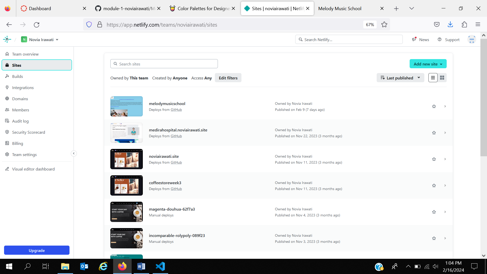
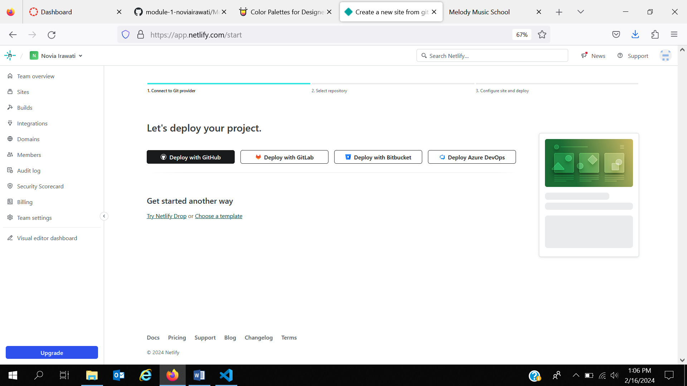
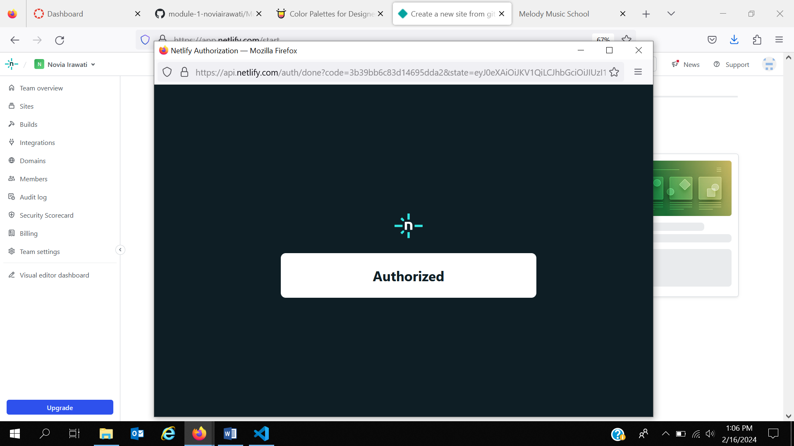
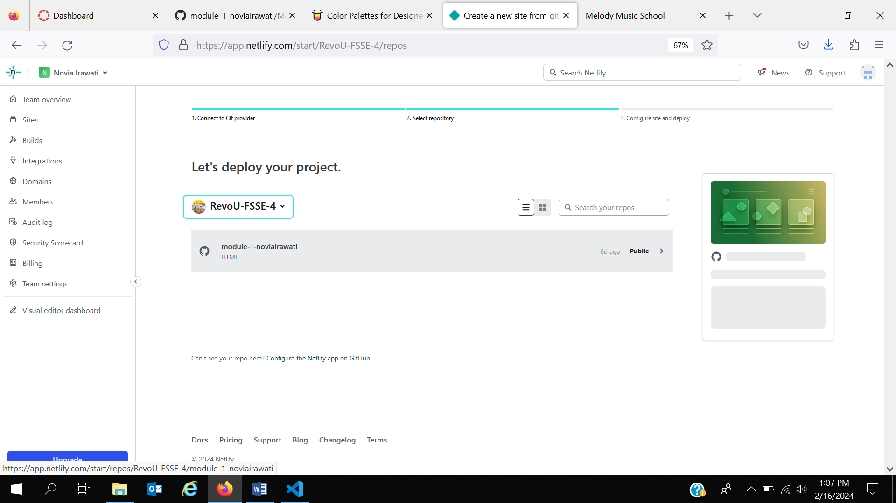

# Hello I'm Ira,
I want to share my assigment white theme *Melody Music School*

Melody Music School [Here's my deploy]()

### HTML Structure
### I use semantic element:
1. Header
2. Main
3. Footer

### Git Command
#### Getting & Creating Projects
|Command                                                         |	Description                                 |
|-----------                                                     |----------                                    |
|git init                                                        |	Initialize a local Git repository           |
|git clone ssh://git@github.com/[username]/[repository-name].git |	Create a local copy of a remote repository  |
|                                                                |                                              |

#### Basic Snapshotting
|Command 	                                                    |Description                                      | 
|-------------------------------------------------------------- |----------                                       |
|git status 	                                                |Check status                                     |
|git add [file-name.txt] 	                                    |Add a file to the staging area                   |
|git add -A 	                                                |Add all new and changed files to the staging area|
|git commit -m "[commit message]" 	                            |Commit changes                                   |
|git rm -r [file-name.txt] 	                                    |Remove a file (or folder)                        |
|                                                               |                                       |

#### Branching & Merging
|Command 	                        |Description                                             |
|-----------------------------------|----------                                              |
|git branch 	                    |List branches (the asterisk denotes the current branch) |
|git branch -a 	                    |List all branches (local and remote)                    |
|git branch [branch name] 	        |Create a new branch                                     |
|git branch -d [branch name] 	    |Delete a branch                                         |
|git push origin --delete [branch name] |Delete a remote branch                              |
|git checkout -b [branch name] 	    |Create a new branch and switch to it                    |
|git checkout -b [branch name] origin/[branch name] | Clone a remote branch and switch to it |
|git branch -m [old branch name] [new branch name] |Rename a local branch                    |
|git checkout [branch name] 	    |Switch to a branch                                      |
|git checkout - 	                |Switch to the branch last checked out                   |
|git checkout -- [file-name.txt] 	|Discard changes to a file                               |
|git merge [branch name] 	        |Merge a branch into the active branch                   |
|git merge [source branch] [target branch] |Merge a branch into a target branch              |
|git stash 	                        |Stash changes in a dirty working directory              |
|git stash clear 	                |Remove all stashed entries
|                                   |                                                        |

#### Sharing & Updating Projects
|Command 	                                                    |Description                                      |
|-------------------------------------------------------------- |----------                                       |
|git push origin [branch name] 	                                |Push a branch to your remote repository          |
|git push -u origin [branch name] 	                            |Push changes to remote repository (and remember the branch)|
|git push 	                                                    |Push changes to remote repository (remembered branch)|
|git push origin --delete [branch name] 	                    |Delete a remote branch                           |
|git pull 	                                                    |Update local repository to the newest commit     |
|git pull origin [branch name] 	                                |Pull changes from remote repository              |
|git remote add origin ssh://git@github.com/[username]/[repository-name].git 	|Add a remote repository          |
|git remote set-url origin ssh://git@github.com/[username]/[repository-name].git    |Set a repository's origin branch to SSH|
|                                                                |                                                 |

#### Inspection & Comparison
|Command 	                                                    |Description                                      |
|-------------------------------------------------------------- |----------                                       |
|git log 	                                                    |View changes                                     |
|git log --summary 	                                            |View changes (detailed)                          |
|git log --oneline 	                                            |View changes (briefly)                                                       |
|git diff [source branch] [target branch] 	                    |Preview changes before merging                   |
|                                                               |                                                 |

### Deployment Prosess

#### Netlify Sign Up Process & Connect Netlify to Github
1. Open "[netlify](https://app.netlify.com/)"

2. Clicking "Sign Up"

3. Choose "Sign Up with git Hub"

4. Enter "Username" and "password" > next Clicking "Sign in", Then, Verify your device > Clicking "Verify"

6. All Done, your netlify is live

#### Auto Deployement on Github with Netlify
1. Add New Site

2. Link to Your GitHub (or supported version-control tool of choice), then Clicking "Import an Existing Project"

3. Authorize Netlify
It's time to authorized your Netlify and GitHub to connect each other. Clicking the "Authorized"

4. Select Your Repo
Now that you've connected Netlify and GitHub, you can see a list of your Git repos. Choose the repo you’d like to deploy from the list.

5. Configure Your Settings
click the "Deploying" button to continue.

6. Build Your Site
Now it's time to sit back and relax. You did your part; let Netlify take care of the rest. It'll only take a minute.

7. All Done
Once the build completes, your site is live! Head to the overview and you can see the URL of your newly published site.

Netlify automatically generated a name for your site. Let's update that by visiting the settings tab and clicking "Change site name".

Thank You :)